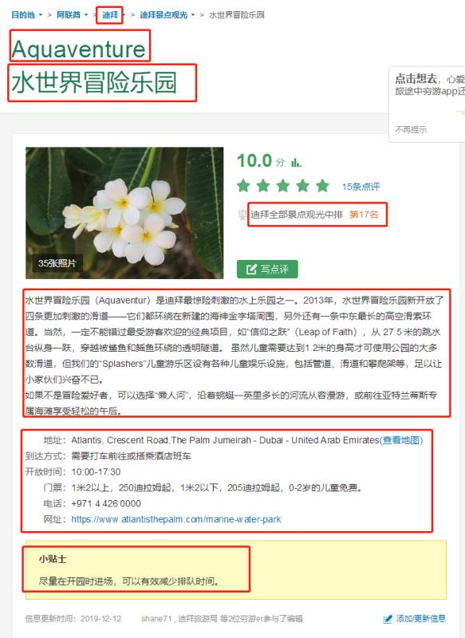
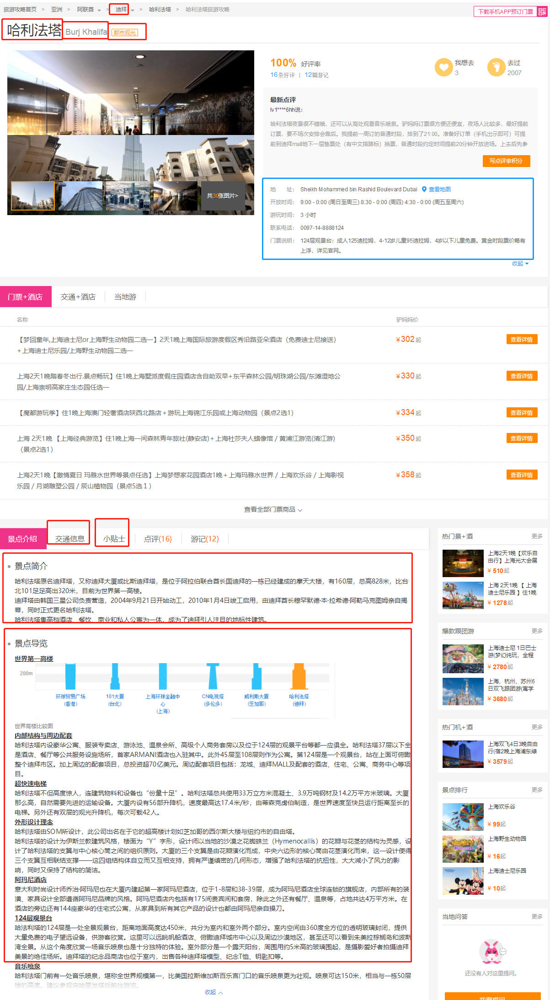

# travel_spider 旅游POI爬虫
* 本项目的需求是为了满足旅行社项目POI数据而创建。
## 2020.04.0.7 需求

资料库的数据。
* https://place.qyer.com/poi/V2IJYVFiBzJTYg/
* https://www.mafengwo.cn/poi/5424045.html
* http://www.lvmama.com/lvyou/poi/sight-152590.html

## 穷游需求

这个数据比较多，就取前15页的就行。 这个取多少页最好也设置为字段，因为有些国家比如这个阿联酋是15页，有一些可能不到15页，有些也可能超过。
图片中蓝色的部分，如果能爬下来按字段分开存储是最好的。

## 驴妈妈需求

